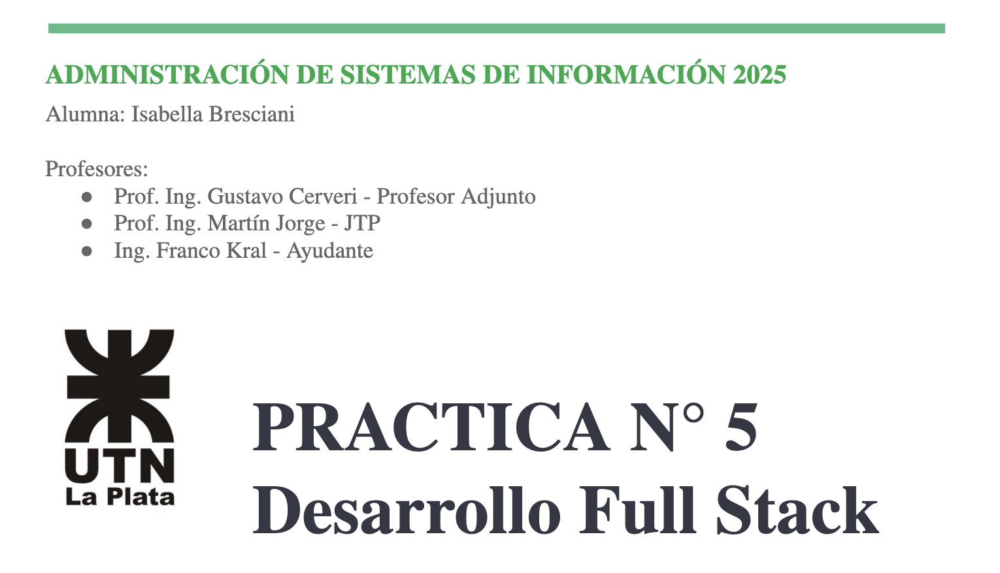
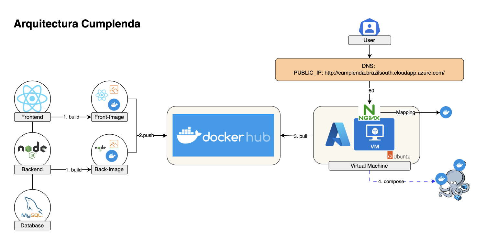

# Recursos
* Link Video: TP5 DEMO ADR - Isabella Bresciani.mov
* PDF: ADR PRACTICA N° 5 - Bresciani Isabella.pdf
* Codigo: deploy.sh | backend/ | frontend/ | docker-compose.yml | init.sql

# Arquitecutra de la solución:

# Temas de la unidad
a. Docker.
b. Azure.
c. Desarrollo web.
d. Máquinas virtuales.
e. Nginx.

# Contexto
Imagina que has sido contratado/a por una startup tecnológica que necesita una aplicación web funcional y lista para producción. Tu rol como desarrollador/a Full Stack será fundamental para construir toda la solución desde cero. La empresa requiere un equipo ágil capaz de desarrollar tanto el backend como el frontend, asegurando la comunicación eficiente entre ambas partes y desplegando la solución final en la nube.

# Objetivos principales del trabajo
Aplicar conocimientos reales de desarrollo web full stack.
Aprender sobre integración y despliegue en entornos de producción.
Entender la importancia del versionamiento de código, la contenerización y el despliegue en la nube.

# Cumplenda
Cumplenda es una aplicación web diseñada para resolver un problema simple pero universal: no olvidar nunca más el cumpleaños de un ser querido. En un mundo lleno de notificaciones y distracciones, Cumplenda ofrece un espacio centralizado, privado y enfocado. Permite a los usuarios crear una cuenta segura para registrar y gestionar las fechas de nacimiento de amigos, familiares y colegas. Su principal ventaja es la simplicidad: una interfaz limpia que muestra los próximos cumpleaños de forma ordenada, ayudando al usuario a planificar con antelación y a mantener vivas sus relaciones importantes.

