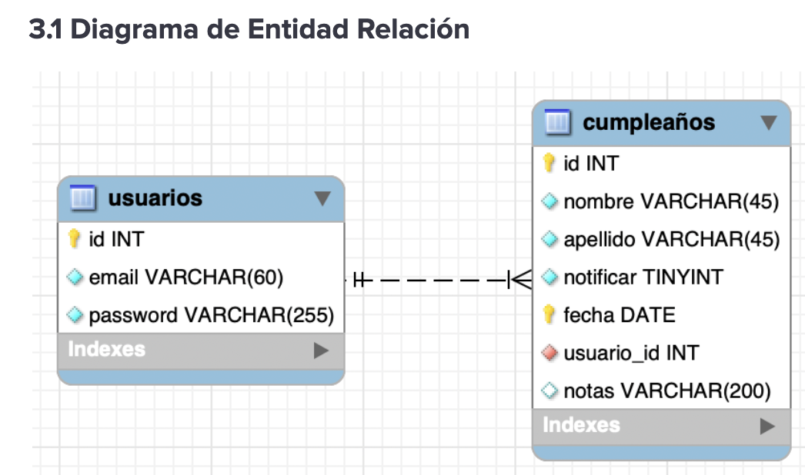

# Cumplenda
Cumplenda es una aplicación web diseñada para resolver un problema simple pero universal: no olvidar nunca más el cumpleaños de un ser querido. En un mundo lleno de notificaciones y distracciones, Cumplenda ofrece un espacio centralizado, privado y enfocado. Permite a los usuarios crear una cuenta segura para registrar y gestionar las fechas de nacimiento de amigos, familiares y colegas. Su principal ventaja es la simplicidad: una interfaz limpia que muestra los próximos cumpleaños de forma ordenada, ayudando al usuario a planificar con antelación y a mantener vivas sus relaciones importantes.

# Arquitectura del Backend
Para el desarrollo del backend se utilizó una arquitectura por capas, un patrón de diseño que promueve la separación de responsabilidades y la modularidad del código. Esta estructura facilita el mantenimiento, la escalabilidad y las pruebas de la aplicación. Como se observa en la estructura de directorios, el flujo de una solicitud atraviesa varias capas bien definidas.

*   **Capa de Rutas (Routes):**
    *   Ubicada en el directorio `src/routes`.
    *   Es el punto de entrada para todas las solicitudes de la API. Define los endpoints y los métodos HTTP (GET, POST, PUT, DELETE) asociados.
    *   `authRoutes.js`: Gestiona las rutas de autenticación, como `/register` y `/login`.
    *   `birthdayRoutes.js`: Maneja las rutas para las operaciones CRUD (Crear, Leer, Actualizar, Borrar) de los cumpleaños.
    *   Cada ruta se encarga de invocar la función correspondiente en la capa de controladores.

*   **Capa de Middleware:**
    *   Ubicada en el directorio `src/middleware`.
    *   Contiene funciones que se ejecutan antes de que la solicitud llegue al controlador.
    *   `authMiddleware.js`: Es una pieza clave para la seguridad. Verifica el token de autenticación (JWT) en las solicitudes a rutas protegidas, asegurando que solo los usuarios autenticados puedan acceder y modificar sus propios datos de cumpleaños.

*   **Capa de Controladores (Controllers):**
    *   Ubicada en el directorio `src/controllers`.
    *   Actúa como intermediario entre las rutas y la lógica de negocio. Su función es recibir la solicitud, validar los datos de entrada (headers, params, body) y enviar una respuesta al cliente.
    *   `authController.js`: Contiene la lógica para gestionar el registro y la autenticación de usuarios. Invoca a los servicios de autenticación para validar credenciales y generar tokens.
    *   `birthdaysController.js`: Maneja las solicitudes relacionadas con los cumpleaños. Orquesta las operaciones como crear un nuevo cumpleaños, obtener la lista, actualizar uno existente o eliminarlo, delegando la lógica a la capa de servicios.

*   **Capa de Servicios (Services):**
    *   Ubicada en el directorio `src/services`.
    *   Aquí reside la lógica de negocio principal de la aplicación. Esta capa está desacoplada de la tecnología de la base de datos y del protocolo HTTP.
    *   `AuthService.js`: Implementa la lógica compleja de autenticación, como el hasheo de contraseñas y la generación y verificación de JSON Web Tokens (JWT).
    *   (Se asume la existencia de un `BirthdayService.js` que contendría la lógica para validar fechas, calcular próximos cumpleaños, etc.).

*   **Capa de Acceso a Datos (DAOs - Data Access Objects):**
    *   Ubicada en el directorio `src/daos`.
    *   Esta capa encapsula toda la lógica de interacción con la base de datos. Su propósito es abstraer las operaciones de la base de datos del resto de la aplicación.
    *   `UserDao.js`: Se comunica con la base de datos para realizar operaciones sobre la colección de usuarios (crear, buscar por email, etc.).
    *   `BirthdayDao.js`: Ejecuta las consultas a la base de datos para gestionar los registros de cumpleaños asociados a un usuario.

*   **Capa de Modelos (Models):**
    *   Ubicada en el directorio `src/models`.
    *   Define la estructura y el esquema de los datos que se almacenan en la base de datos.
    *   `User.js`: Define el esquema para un usuario (ej. nombre, email, contraseña).
    *   `Birthday.js`: Define el esquema para un cumpleaños (ej. nombre, fecha, relación, ID de usuario asociado).

*   **Manejo de Errores (Exceptions):**
    *   El directorio de excepciones (`BadRequestException.js`, `NotFoundException.js`, etc.) demuestra un sistema de manejo de errores centralizado y robusto, permitiendo enviar respuestas de error consistentes y claras al cliente.